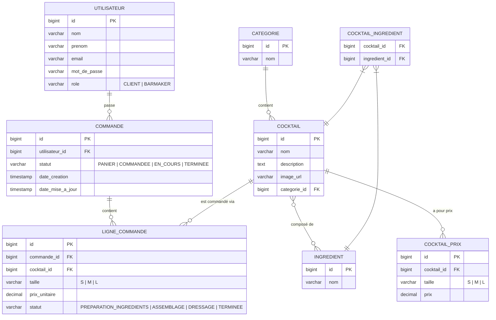

# MCD — Bar'app

## Statuts

### Commande
| Statut | Description |
|---|---|
| `PANIER` | En cours de constitution par le client |
| `COMMANDEE` | Lancée par le client, en attente de traitement |
| `EN_COURS` | Au moins un cocktail en préparation |
| `TERMINEE` | Tous les cocktails terminés |

### Ligne de commande
| Statut | Description |
|---|---|
| `PREPARATION_INGREDIENTS` | Étape initiale |
| `ASSEMBLAGE` | Ingrédients prêts, assemblage en cours |
| `DRESSAGE` | Assemblage terminé, présentation |
| `TERMINEE` | Cocktail prêt |

## Règle métier clé
Quand **toutes** les `ligne_commande` d'une `commande` passent à `TERMINEE`, la `commande` passe automatiquement à `TERMINEE`.
